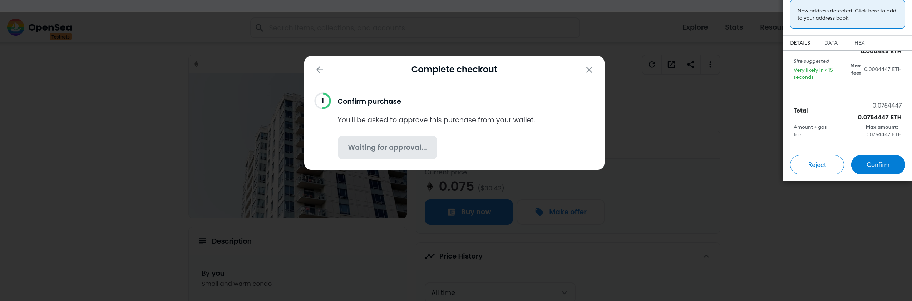

# NFT zokrates

## Software Libraries
| software | version                |
| -------- | ---------------------- |
| Truffle  | v5.5.14 (core: 5.5.14) |
| Ganache  | v^7.1.0                |
| Solidity | 0.8.13 (solc-js)       |
| Node     | v16.13.1               |
| Web3.js  | v1.5.3                 |
|@openzeppelin/contracts|v4.6.0     |
|@truffle/hdwallet-provider|v2.0.9  |


## Set up 

1. truffle.js in eth-contract
2. install `npm install truffle-hdwallet-provider`
3. add `// SPDX-License-Identifier: MIT` at the top of all *.sol*


### Set up zokrates
1. compile code from one who wants to request zk proof to the other
```
docker run -v /home/lunarpulse/Projects/Crypto/typescript-node/nd1301/Blockchain-Capstone/zokrates/code:/home/zokrates/code -ti zokrates/zokrates zokrates compile -i /home/zokrates/code/square/square.code -o /home/zokrates/code/square_test
```
2. set up and create proving.key with compiled binary
```
docker run -v /home/lunarpulse/Projects/Crypto/typescript-node/nd1301/Blockchain-Capstone/zokrates/code:/home/zokrates/code -ti zokrates/zokrates zokrates setup -i /home/zokrates/code/square_test -p /home/zokrates/code/proving.key -v /home/zokrates/code/verification.key -s g16
```
3. compile code by other account
```
docker run -v /home/lunarpulse/Projects/Crypto/typescript-node/nd1301/Blockchain-Capstone/zokrates/code:/home/zokrates/code -ti zokrates/zokrates zokrates compile -i /home/zokrates/code/square/square.code -o /home/zokrates/code/alice/square_test
```
4. compute `witness` file with compiled binary and args,  arg numbers needs to match
```
docker run -v /home/lunarpulse/Projects/Crypto/typescript-node/nd1301/Blockchain-Capstone/zokrates/code:/home/zokrates/code -ti zokrates/zokrates zokrates compute-witness  --verbose -i /home/zokrates/code/alice/square_test -a 3 9 -o /home/zokrates/code/alice/witness_alice
```
5. generate-proof  with `witness`
```
docker run -v /home/lunarpulse/Projects/Crypto/typescript-node/nd1301/Blockchain-Capstone/zokrates/code:/home/zokrates/code -ti zokrates/zokrates zokrates generate-proof --verbose -i /home/zokrates/code/alice/square_test -j /home/zokrates/code/alice/proof_alice.json -p /home/zokrates/code/alice/proving.key -w /home/zokrates/code/alice/witness_alice
```
6. give generated `proof.json` file back to the one who wants request 
```
cp /home/lunarpulse/Projects/Crypto/typescript-node/nd1301/Blockchain-Capstone/zokrates/alice/proof_alice_412.json /home/lunarpulse/Projects/Crypto/typescript-node/nd1301/Blockchain-Capstone/zokrates/bob/proof_alice_412.json
```
7. verify it with verification key and proof from the other
```
docker run -v /home/lunarpulse/Projects/Crypto/typescript-node/nd1301/Blockchain-Capstone/zokrates/code:/home/zokrates/code -ti zokrates/zokrates zokrates verify -j /home/zokrates/code/alice/proof_alice_412.json -v /home/zokrates/code/bob/verification.key
```

8. go back to step 5 and make more `proof.json` with different args and send back to the proof requester and verify, in this project, `Verify` contract, from verify.sol.

## test results
### TestERC721Mintable
```
  Contract: TestERC721Mintable
    match erc721 spec
      ✔ should return total supply
      ✔ should get token balance (47ms)
      ✔ should return token uri (827ms)
      ✔ should transfer token from one owner to another (198ms)
    have ownership properties
      ✔ should fail when minting when address is not contract owner (76ms)
      ✔ should return contract owner


  6 passing (20s)
```

###  TestSolnSquareVerifier
```
  Contract: TestSolnSquareVerifier
    ✔ ERC721 token can be minted for contract (2403ms)
    solution square verifier test
      ✔ a new solution can be added for contract (87ms)


  2 passing (4s)
```
### Testverifier
```
  Contract: Testverifier
    test verification with correct proof
      ✔ verification with correct proof (756ms)
    test verification with correct proof
      ✔ verification with incorrect proof (691ms)


  2 passing (3s)
```
## Deployments
### Rinkerby
```
$truffle deploy --reset --network rinkeby                    

Compiling your contracts...
===========================
> Everything is up to date, there is nothing to compile.


Starting migrations...
======================
> Network name:    'rinkeby'
> Network id:      4
> Block gas limit: 29970705 (0x1c95111)


1_initial_migration.js
======================

   Deploying 'Migrations'
   ----------------------
   > transaction hash:    0xc396803e2bfe7fd481cac188e20b7b77263984e716690eb08e6ed392f6a3e2b6
   > Blocks: 2            Seconds: 21
   > contract address:    0x5D6d330dea98c00265CaD6C4C0c99443ECab54e6
   > block number:        10913803
   > block timestamp:     1656162456
   > account:             0xb9BfF2aef0Ed16Fb4f21aB4d5FE49a70aa83cF62
   > balance:             0.277078948713288771
   > gas used:            274088 (0x42ea8)
   > gas price:           1.500000007 gwei
   > value sent:          0 ETH
   > total cost:          0.000411132001918616 ETH

   Pausing for 2 confirmations...

   -------------------------------
   > confirmation number: 1 (block: 10913804)
   > confirmation number: 2 (block: 10913805)
   > Saving migration to chain.
   > Saving artifacts
   -------------------------------------
   > Total cost:     0.000411132001918616 ETH


2_deploy_contracts.js
=====================

   Deploying 'Verifier'
   --------------------
   > transaction hash:    0xd885618f1ed0803c2390ef2cc3aad1fe5ac66cb0941cfee91a52b3d2099b007b
   > Blocks: 1            Seconds: 9
   > contract address:    0xF1aBbA7A261ecD4cf65089bb5d1352D2436bd86F
   > block number:        10913807
   > block timestamp:     1656162516
   > account:             0xb9BfF2aef0Ed16Fb4f21aB4d5FE49a70aa83cF62
   > balance:             0.275217282204600994
   > gas used:            1195176 (0x123ca8)
   > gas price:           1.500000007 gwei
   > value sent:          0 ETH
   > total cost:          0.001792764008366232 ETH

   Pausing for 2 confirmations...

   -------------------------------
   > confirmation number: 1 (block: 10913808)
   > confirmation number: 2 (block: 10913809)

   Deploying 'SolnSquareVerifier'
   ------------------------------
   > transaction hash:    0x5fc4253c9b1fc51e6a7813915e880f6699a3dd488c40ccae8a8866559e6d593f
   > Blocks: 2            Seconds: 21
   > contract address:    0xD5bdD50Ca9F44590be27C291cDEa04Ea06ad2e93
   > block number:        10913811
   > block timestamp:     1656162576
   > account:             0xb9BfF2aef0Ed16Fb4f21aB4d5FE49a70aa83cF62
   > balance:             0.26781539417005885
   > gas used:            4934592 (0x4b4bc0)
   > gas price:           1.500000007 gwei
   > value sent:          0 ETH
   > total cost:          0.007401888034542144 ETH

   Pausing for 2 confirmations...

   -------------------------------
   > confirmation number: 1 (block: 10913812)
   > confirmation number: 2 (block: 10913813)
   > Saving migration to chain.
   > Saving artifacts
   -------------------------------------
   > Total cost:     0.009194652042908376 ETH

Summary
=======
> Total deployments:   3
> Final cost:          0.009605784044826992 ETH
```

## Creation of NFT tokens on the block chain
1. create the proof files using the instructions above, use proving key created for the project in `./zokrates/code/square/proving.key`
```
docker run -v /home/lunarpulse/Projects/Crypto/typescript-node/nd1301/Blockchain-Capstone/zokrates/code:/home/zokrates/code -ti zokrates/zokrates zokrates compute-witness  --verbose -i /home/zokrates/code/square/square -a {differnt a} {differnt b} -o /home/zokrates/code/square/witness_{sequence}

docker run -v /home/lunarpulse/Projects/Crypto/typescript-node/nd1301/Blockchain-Capstone/zokrates/code:/home/zokrates/code -ti zokrates/zokrates zokrates generate-proof --verbose -i /home/zokrates/code/square/square -p /home/zokrates/code/square/proving.key  -w /home/zokrates/code/square/witness_{sequence} -j /home/zokrates/code/square/proof_{sequence}.json

```
2. use remix-ide to interact with the contract.


### Rinkeby network transaction history
- [rinkeby Cosmos Realestate NFT token](https://rinkeby.etherscan.io/token/0xd5bdd50ca9f44590be27c291cdea04ea06ad2e93?a=0xb9bff2aef0ed16fb4f21ab4d5fe49a70aa83cf62)
- [Token Cosmos Realestate NFT](https://rinkeby.etherscan.io/token/0xd5bdd50ca9f44590be27c291cdea04ea06ad2e93)

| software | version                |
| -------- | ---------------------- |
| Migrations  |https://rinkeby.etherscan.io/address/0x5D6d330dea98c00265CaD6C4C0c99443ECab54e6|
| Verifier  |https://rinkeby.etherscan.io/address/0xF1aBbA7A261ecD4cf65089bb5d1352D2436bd86F|
| SolnSquareVerifier |https://rinkeby.etherscan.io/address/0xF1aBbA7A261ecD4cf65089bb5d1352D2436bd86F|

### ABI
- [SolnSquareVerifier](./abi/SolnSquareVerifier.json)

### opensea market place

- [OpenSea MarketPlace Storefront Cosmos-realestate-nft Collection](https://testnets.opensea.io/collection/cosmos-realestate-nft)

#### Cosmos-realestate-nft USERS
- [USER1](https://testnets.opensea.io/0x5cf792408478A928D1B40eFd89D389f36ABf6a45)
- [USER2](https://testnets.opensea.io/0xb9BfF2aef0Ed16Fb4f21aB4d5FE49a70aa83cF62)

#### Selling and Buying Cosmos-realestate-nft Tokens on OpenSea MarketPlace


# Resources

* [Remix - Solidity IDE](https://remix.ethereum.org/)
* [Visual Studio Code](https://code.visualstudio.com/)
* [Truffle Framework](https://truffleframework.com/)
* [Ganache - One Click Blockchain](https://truffleframework.com/ganache)
* [Open Zeppelin ](https://openzeppelin.org/)
* [Interactive zero knowledge 3-colorability demonstration](http://web.mit.edu/~ezyang/Public/graph/svg.html)
* [Docker](https://docs.docker.com/install/)
* [ZoKrates](https://github.com/Zokrates/ZoKrates)